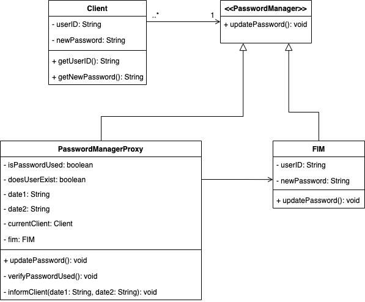

# Proxy-Pattern

## Introduction
The Proxy Pattern is a software design pattern that is considered to be a structural pattern when discussing software architecture. This design pattern allows us to control access to a particular resource and only use it when it is deemed absolutely necessary to the system. The Proxy Pattern gives us the ability to do so by creating a proxy object that acts as an intermediary to the real object/resource. This design pattern ensures that communication with the valuable resource is kept at a minimum. Clients of a system designed under the Proxy Pattern are able to interact with the proxy in the same manner as they would with the actual resource. The difference here is that the proxy object of the system forwards the client's request to the actual resource and then the proxy returns the response of the resource back to the client. During this entire process, the client is completely unaware that a proxy exists and it seems as if they are directly communicating with the resource.

The Proxy Pattern is quite helpful when there is a resource that is expensive to create, is made up of complex processes, or lives in a remote location. As mentioned above, the Proxy Pattern allows us to create a connection to the resource only when it is absolutely needed and also allows us to extend further functionality for the resource.

In this assignment, the Proxy Pattern will be implemented to show how an intermediary acts an an interface between the client and the sought after/valuable resource which in this example is the Federated Identity Management (FIM) system. The FIM system is located on a remote site and the proxy in this case will be the intermediary between the client and this FIM system which will take care of verifying a client's request to change their password. The FIM system, in this case, is the valuable resource in question which we would like to reduce communication with and only access it when we know that a client can change/update their password. This means that the Proxy Pattern is well-suited for this application as the proxy between the client and the FIM system can reduce communication with the FIM system and perform verification of whether or not the client's password can up changed to their new password. The client will request an update of their password by providing their unique ID and the new password that they would like to update to. This request will be sent to the proxy and it will verify that the new password that the client has chosen to update to has not been previously used by checking a local file that contains records of user ID's, their previously used passwords, and the start and end dates of the password's usage. If the proxy verifies that the new password that the client would like to update to has never been used before (is fresh), then the proxy will connect with the FIM system to adopt the new password and it will also inform the client that their password change was approved. On the other hand, if the proxy sees that the new password that the client wants to update to has been used before, it will also notify the client that their password cannot be changed as it has been used before (will also show the start and end date of the password's usage).

Through this example, it can be seen that the Proxy Pattern is quite helpful in the sense that it helps minimize the access of valuable resources. This will allow the software system to improve its performance, security, and maintainability. The Proxy can also be seen adding additional functionality on top of the FIM system, providing a verification method to see if the client's request should be forwarded to the FIM system.

## Class Diagram

  

## User Guide
This section will walk you through running the application. There are two ways you can run and test the application yourself, either by executing the JAR or by running it in your IDE.
- **Running Application Through JAR Executable**
  - **NOTE:** This method of running the application will change the `.txt` files in the `RUN-ME` directory. If you would like to further test the application, please edit the `.txt` files in this directory as these are the files that the JAR has access to.
    - Download and unzip the provided .zip file
    - Navigate into the `Proxy-Pattern` directory using your terminal of choice 
    - From here, navigate into the `RUN-ME` directory using the following command: `cd RUN-ME`
    - Now run the followinng command: `java -jar Proxy-Pattern.jar`
- **Running Application Through Your IDE**  
  - **NOTE:** This method of running the application will change the `.txt` files in the `records` directory in the `Proxy-Pattern` folder. If you would like to further test the application, please edit the `.txt` files in this directory as these are the files that the IDE has access to.
    - Download and unzip the provided .zip file
    - Open the `Proxy-Pattern` folder in your IDE of choice (your IDE should have Java available to it)
    - Run the `App.java` file and begin using the application in the terminal the pop up
